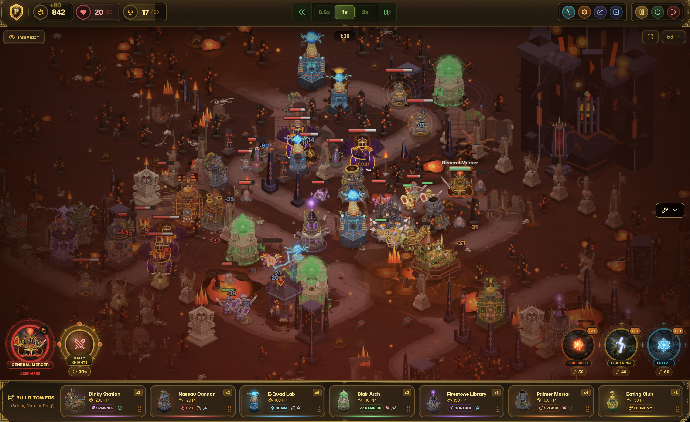
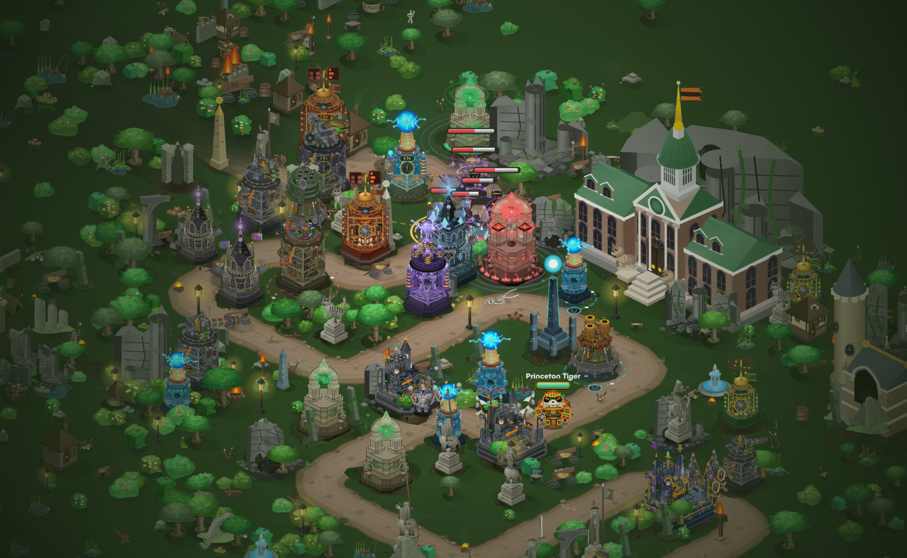
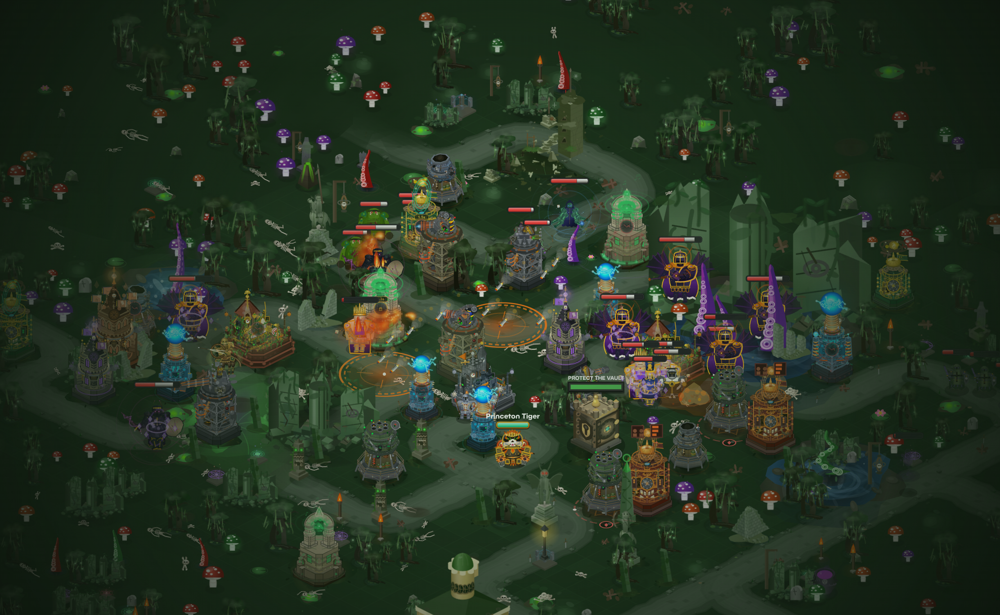
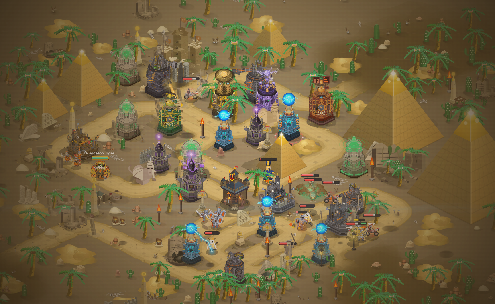
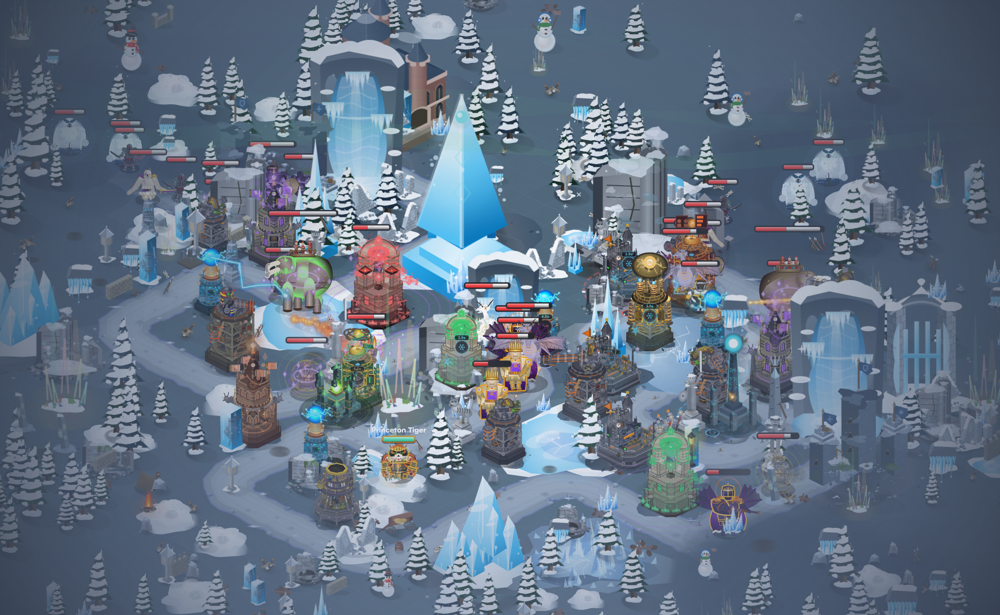
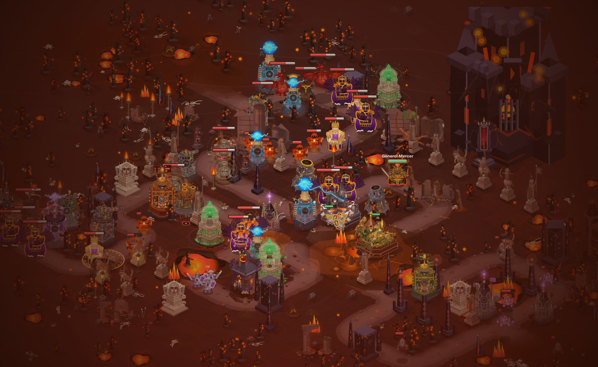
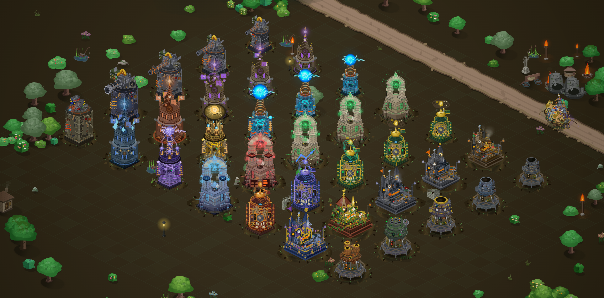

<div align="center">


# Princeton Tower Defense

A full-featured tower defense game built entirely in the browser with React, Canvas 2D, and Next.js.

Defend Princeton-inspired battlefields across 5 hand-crafted biome regions with branching tower upgrades, 9 playable heroes, tactical spells, and dual-lane pressure maps that actually require you to think.

**[Play Now](https://princetontd.vercel.app/)** | **[Report Bug](https://github.com/Kevin-Liu-01/Princeton-Tower-Defense/issues)** | **[Portfolio](https://www.kevin-liu.tech/)**

---

<div align="center">
Special thanks to [Nicky He](https://github.com/NickyHeC) for her relentless QA and suggestions.
</div>
</div>

---



## Project Overview

Princeton Tower Defense is a browser-based tower defense game set at Princeton University. Players defend against waves of enemies using towers, heroes, and spells across 26 levels spanning 5 biome regions: Grassland, Swamp, Desert, Winter, and Volcanic.

Everything -- towers, enemies, terrain, effects, UI overlays -- is drawn and animated in code. There are no sprite sheets and no game engine. The entire rendering pipeline (isometric terrain, tower animations, projectile arcs, death effects, fog, god rays, ambient particles) is hand-written Canvas 2D. Static layers are cached to offscreen canvases, and quality-aware rendering adjusts detail based on runtime performance.

<div align="center">

|                                                    |                                                     |                                                  |
| :------------------------------------------------: | :-------------------------------------------------: | :----------------------------------------------: |
|  |       |  |
|          _Princeton Grounds - Grassland_           |               _Murky Marshes - Swamp_               |             _Sahara Sands - Desert_              |
|    |  |   |
|             _Frozen Frontier - Winter_             |              _Volcanic Depths - Lava_               |              _All 7 Campus Towers_               |

</div>

---

## Tech Stack

| Layer             | Technology                                                         |
| :---------------- | :----------------------------------------------------------------- |
| **Framework**     | Next.js 14, React 18                                               |
| **Language**      | TypeScript                                                         |
| **Styling**       | Tailwind CSS                                                       |
| **Rendering**     | HTML5 Canvas 2D (custom, no game engine)                           |
| **UI Components** | Radix Themes                                                       |
| **Animation**     | Framer Motion, `requestAnimationFrame` game loop with delta-time   |
| **Icons**         | Lucide React                                                       |
| **3D Elements**   | Three.js via React Three Fiber + Drei                              |
| **Analytics**     | Vercel Analytics                                                   |
| **State**         | React hooks + localStorage persistence (no external state library) |
| **Hosting**       | Vercel                                                             |

---

## Getting Started

### Prerequisites

- **Node.js** 18 or later
- **pnpm** (recommended package manager)

### Installation

```bash
git clone https://github.com/Kevin-Liu-01/Princeton-Tower-Defense.git
cd Princeton-Tower-Defense
pnpm install
```

### Development

```bash
pnpm dev
```

Open [http://localhost:3000](http://localhost:3000) to play.

### Production Build

```bash
pnpm build
pnpm start
```

### Linting

```bash
pnpm lint
```

---

## Environment Variables

| Variable                  | Description                                                                   |
| :------------------------ | :---------------------------------------------------------------------------- |
| `NEXT_PUBLIC_TD_DEV_PERF` | Set to `"1"` to enable the dev performance overlay (toggle with Ctrl+Shift+P) |

This is the only environment variable. The game runs without any `.env` configuration.

---

## Folder Structure

```
src/app/
├── components/
│   ├── menus/              # World map, campaign overview, level select,
│   │   ├── shared/         #   codex, settings, victory/defeat screens
│   │   └── world-map/      #   World map canvas renderer + extracted modules
│   │       └── rendering/  #   Biome-specific decoration renderers
│   ├── ui/                 # In-game UI
│   │   ├── hud/            #   Top HUD, hero spell bar, performance overlay
│   │   ├── primitives/     #   BaseModal, OrnateFrame, TagBadge, logo
│   │   ├── tooltips/       #   Tower, enemy, hero, environment tooltips
│   │   ├── upgrades/       #   Spell upgrade modal and flows
│   │   └── system/         #   Theme tokens, shared hooks
│   └── creator/            # Custom level editor
│
├── hooks/
│   ├── runtime/            # Game loop, rendering, camera, event handling,
│   │                       #   spell execution, wave preview, zoom/gestures
│   ├── useLocalStorage.ts  # Typed localStorage wrapper
│   ├── useCustomLevels.ts  # Custom level CRUD
│   └── useTutorial.ts      # Tutorial flow state machine
│
├── game/                   # Core game logic (pure functions, no React)
│   ├── setup/              #   Level initialization, enemy pathing, formations
│   ├── state/              #   Battle state reset and transitions
│   ├── spatial/            #   Spatial indexing and queries
│   ├── movement/           #   Unit movement and pathfinding
│   ├── status/             #   Status effects (slow, stun, burn, etc.)
│   ├── hazards/            #   Environmental hazard calculation and application
│   └── progression.ts      #   Star scoring, region unlocks
│
├── rendering/              # Canvas 2D draw functions (no React)
│   ├── towers/             #   Tower sprites, upgrades, range indicators
│   ├── enemies/            #   Enemy sprites, health bars, status indicators
│   ├── heroes/             #   Hero sprites and ability VFX
│   ├── troops/             #   Summoned unit rendering
│   ├── effects/            #   Projectiles, explosions, particles
│   ├── decorations/        #   Trees, rocks, structures, biome props
│   ├── maps/               #   Terrain, paths, fog, god rays
│   └── ui/                 #   Canvas-rendered UI elements (build radials, etc.)
│
├── constants/              # Static game data
│   ├── towers.ts           #   Tower stats, upgrade trees, costs
│   ├── enemies.ts          #   Enemy stats, abilities, wave compositions
│   ├── heroes.ts           #   Hero stats, abilities, cooldowns
│   ├── spells.ts           #   Spell definitions and upgrade tiers
│   ├── waves.ts            #   Per-level wave schedules
│   ├── maps.ts             #   Path geometry, hazards, tower restrictions
│   ├── settings.ts         #   Tuning knobs, balance constants
│   ├── storage.ts          #   localStorage key constants
│   └── timing.ts           #   Frame timing and animation constants
│
├── sprites/                # React components for UI sprites
│                           #   Hero portraits, spell icons, tower icons
│
├── types/                  # Shared TypeScript type definitions
│
├── utils/                  # Shared utilities
│                           #   Math, color manipulation, path helpers
│
├── seo/                    # SEO metadata, JSON-LD schemas, constants
│
└── customLevels/           # Custom level types and validation logic
```

---

## Architecture Overview

### Game Loop

The central orchestrator is `usePrincetonTowerDefenseRuntime` (`hooks/usePrincetonTowerDefenseRuntime.tsx`). It owns the top-level game state and delegates work to two primary modules each frame:

1. **Simulation** -- `runtime/updateGame.ts` advances all game state: enemy movement, tower targeting, projectile physics, status effects, hazard ticks, wave spawning, and win/loss conditions.
2. **Rendering** -- `runtime/renderScene.ts` draws the current state to a multi-layer Canvas 2D pipeline.

Supporting runtime modules in `hooks/runtime/` handle camera controls, input events, spell execution, zoom/gestures, build-drag interactions, wave preview, and tutorial callbacks.

### State Management

All game state lives in React hooks (`useState`, `useRef`) and mutable entity collections. There is no external state management library (no Redux, Zustand, or Jotai). Persistent data (campaign progress, settings, custom levels) is serialized to `localStorage` via typed wrappers.

### Canvas 2D Rendering Pipeline

Rendering uses a multi-layer caching strategy:

- **Static map layer** -- terrain, paths, and base decorations are rendered once and cached to an offscreen canvas, redrawn only on zoom or resize.
- **Decoration layer** -- biome props (trees, rocks, structures) cached separately.
- **Fog and atmosphere** -- fog-of-war and atmospheric effects on a dedicated layer.
- **Entity layer** -- towers, enemies, heroes, projectiles, and particles redrawn every frame.
- **UI overlay** -- range indicators, build radials, health bars composited last.

Quality-aware rendering detects frame drops and reduces decoration density, particle counts, and effect complexity at runtime.

### World Map

The world map is rendered with `worldMapCanvasRenderer.ts`, backed by extracted biome-specific decoration modules under `world-map/rendering/`. Each biome (grassland, swamp, desert, winter, volcanic) has its own decoration renderer, road style, and terrain backdrop logic.

---

## Game Features

### 7 Towers with Branching Upgrades

Each tower has a distinct role and two final upgrade paths that change its behavior.

| Tower                 | Role            | Upgrade Paths                        |
| :-------------------- | :-------------- | :----------------------------------- |
| **Nassau Cannon**     | Heavy artillery | Gatling Gun / Flamethrower           |
| **Firestone Library** | Slow + control  | EQ Smasher / Blizzard                |
| **E-Quad Lab**        | Chain magic DPS | Focused Beam / Chain Lightning       |
| **Blair Arch**        | Sonic crescendo | Shockwave Siren / Symphony Hall      |
| **Eating Club**       | Economy         | Investment Bank / Recruitment Center |
| **Dinky Station**     | Troop summons   | Centaur Archers / Heavy Cavalry      |
| **Palmer Mortar**     | Siege AoE       | Missile Battery / Ember Foundry      |

### 9 Playable Heroes

| Hero                | Style            | Ability                                         |
| :------------------ | :--------------- | :---------------------------------------------- |
| **Princeton Tiger** | Melee brawler    | _Mighty Roar_ -- AoE stun + fear                |
| **Acapella Tenor**  | Ranged support   | _High Note_ -- sonic blast + ally heal          |
| **Mathey Knight**   | Tank             | _Fortress Shield_ -- invincibility + taunt      |
| **Rocky Raccoon**   | Ranged artillery | _Boulder Bash_ -- massive AoE damage            |
| **F. Scott**        | Buffer           | _Inspiration Cheer_ -- tower damage/range boost |
| **General Mercer**  | Commander        | _Rally Knights_ -- summon 3 armored knights     |
| **BSE Engineer**    | Utility          | _Deploy Turret_ -- automated defense turret     |

### Spells, Hazards, and Challenge Rules

- **6 castable spells** -- Fireball, Lightning, Freeze, Hex Ward, Payday, and Reinforce, each upgradeable with earned stars.
- **Map hazards** -- lava pools, quicksand, blizzard zones, and special structures (vaults, shrines, barracks, beacons) that add region-specific objectives.
- **Challenge maps** -- tower restrictions and multi-objective scoring that force non-standard strategies.

### World Map and Progression

A fully interactive world map with region nodes, star-gated progression, and a campaign overview. Stars earned from levels unlock new regions, challenge maps, and spell upgrades.

### Custom Level Creator

A built-in map editor for designing and playing custom levels. Define paths, place tower slots, set wave compositions, and share creations.

### Sandbox Mode

An endless, procedurally themed wave arena for testing builds and experimenting with tower compositions. Sandbox starts with 10,000 paw points and generates waves infinitely, cycling through themed enemy packs (Dark Fantasy, Bug Swarm, Beast Horde, and more) with boss waves every 5 rounds and chaos waves every 10.

<video src="public/videos/sandbox-console.mp4" autoplay loop muted playsinline width="100%"></video>

---

## Scalability Risks and Known Limitations

### 1. `updateGame.ts` God Function

`runtime/updateGame.ts` is a single file exceeding 5,000 lines. It handles enemy movement, tower targeting, projectile updates, status effects, wave spawning, hazard ticks, and win/loss evaluation in one function. This makes the simulation difficult to test, reason about, or extend independently. It needs to be split into domain-specific update modules (movement, combat, spawning, scoring) that compose into a pipeline.

### 2. `renderDecorationItem.ts` Monolith

The decoration rendering file exceeds 33,000 lines with a massive switch/case dispatching on decoration type. Every biome's trees, rocks, structures, and props are inlined in one file. This should be refactored into a registry pattern where each decoration type registers its own draw function, reducing file size and enabling per-biome code splitting.

### 3. Global Mutable Registries

`LEVEL_DATA` and `MAP_PATHS` are module-level mutable objects that custom levels write into at runtime. This means loading a custom level mutates global state visible to all consumers, creating implicit coupling and making it unsafe to run multiple game instances or add server-side rendering. These should be replaced with an immutable data layer or scoped context.

### 4. Fixed Particle and Effect Pools

Particle systems and visual effects use fixed-size pools. During long sessions or levels with high enemy density, pools can exhaust, causing effects to silently drop. Pool sizes should be dynamically scaled or overflow should degrade gracefully with priority-based eviction.

### 5. Type Dispatch via Switch/Case

Entity behavior (tower targeting, enemy abilities, status effects) is dispatched through large `switch` statements keyed on string type identifiers. This pattern duplicates dispatch logic across simulation and rendering, and makes adding new entity types error-prone. A registry-map pattern (type string to handler function) would centralize dispatch and simplify extension.

---

## Contributing

1. Fork the repository.
2. Create a feature branch: `git switch -c feature/your-feature`.
3. Make your changes and ensure `pnpm lint` passes with no new warnings.
4. Enable the dev performance overlay (`NEXT_PUBLIC_TD_DEV_PERF=1`) during development to monitor frame times and rendering costs.
5. Open a pull request against `main` with a clear description of what changed and why.

### Development Tips

- The dev performance overlay (Ctrl+Shift+P when the env var is set) shows frame time, entity counts, and render layer costs. Use it to catch performance regressions.
- Run `pnpm build` locally before opening a PR to catch type errors that `pnpm dev` may not surface.
- Keep rendering functions pure where possible: they receive state and a canvas context, and draw. Side-effect-free renderers are easier to test and cache.

---

## Deployment

Deployed on [Vercel](https://vercel.com). Pushing to `main` triggers an automatic production deployment.

```bash
pnpm build    # Verify production build locally before pushing
```

---

<div align="center">

**[Play Princeton TD](https://princetontd.vercel.app/)** | Built by [Kevin Liu](https://www.kevin-liu.tech/)

</div>
